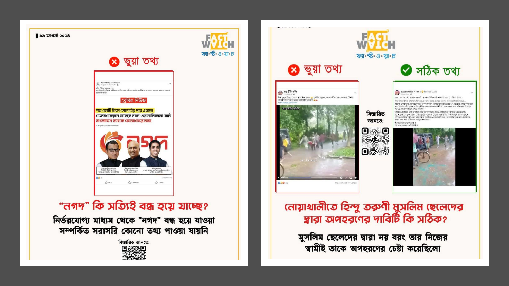
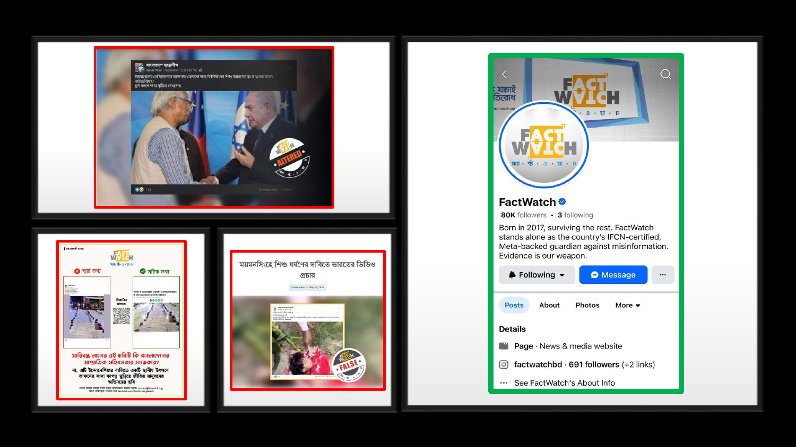
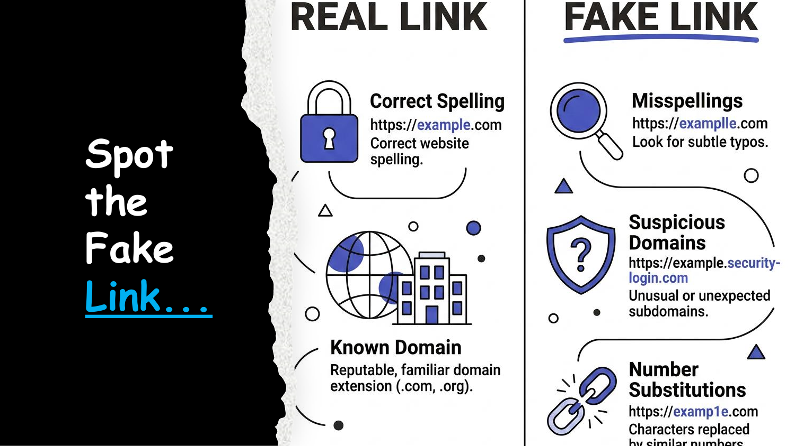
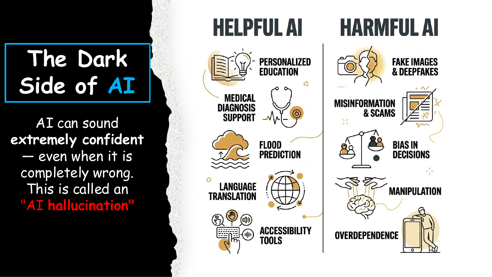
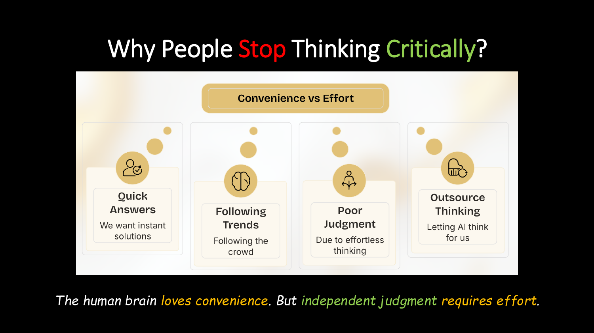
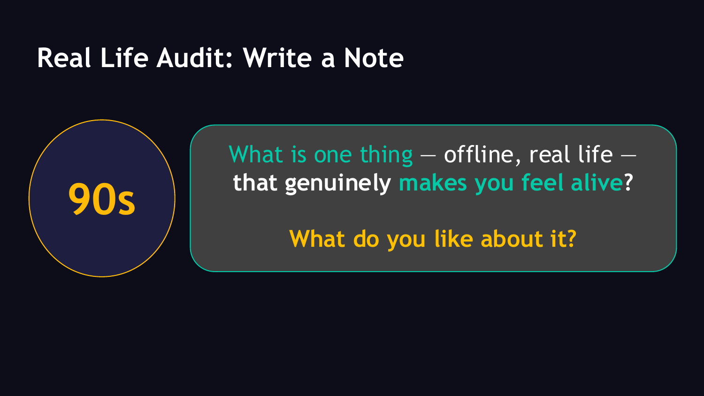
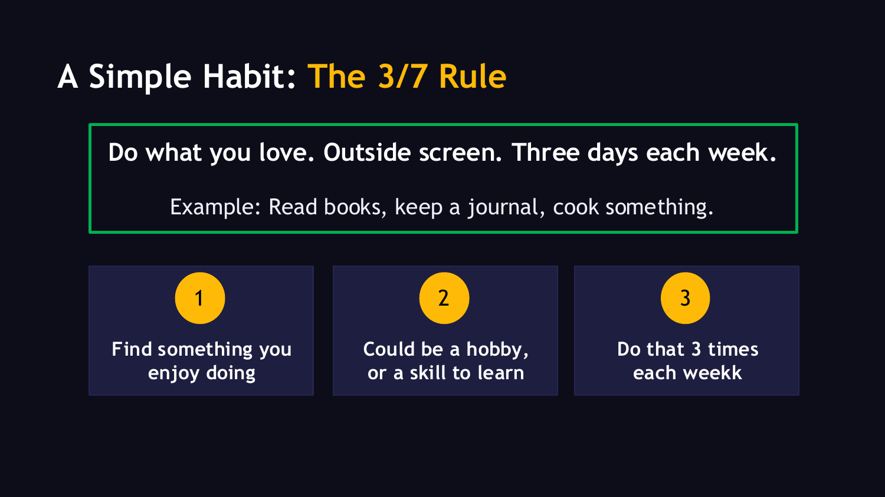
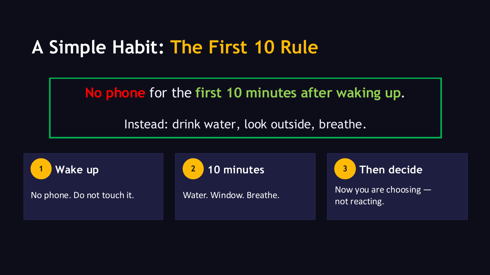

# Digital Citizenship: Full Session Analysis
[Digital_Citizenship_Full_Session.pdf](Digital_Citizenship_Full_Session.pdf)

This document provides a detailed breakdown, structural outline, and content analysis of the 41-page **Digital Citizenship** educational presentation. The session is structured into five distinct chapters designed to guide students and young adults in navigating the complexities, risks, and responsibilities of the digital era.

---

## 📊 Presentation Overview & Structure

* **Document Title:** Digital Citizenship Full Session
* **Target Audience:** Youth, students, and educators (reflected in scenarios involving school, classmates, online gaming, and phone usage habits).
* **Visual Theme:** A high-contrast, dark-mode design system. The slides use a dark blue/purple background (`#0B0E14`), bright blue for headings and chapter numbers, and yellow/pink highlights for icons, key terms, and visual cues.
* **Core Objectives:**
  1. Understand attention economics and reclaim screen time.
  2. Differentiate mis- vs. disinformation and apply verification frameworks (SIFT).
  3. Identify behavioural risks like cyberbullying, phishing, and online scams.
  4. Build a realistic mental model of Artificial Intelligence (AI) strengths, flaws, and human partnerships.
  5. Develop daily critical thinking habits to foster independent judgment.

---

## 🗂️ Section-by-Section Content Analysis

### 01. Attention Literacy (Digital Wellbeing & Attention)
*Pages 1–7*
Focuses on screentime habits, algorithmic engineering, and the mechanics of the dopamine loop.

* **The Lifetime Time Budget (Slide 2 & 3):**
  * Represents a lifetime as 80 blocks (1 block = 1 year).
  * A typical person spends **16.7 years (21% of their life) on screens** and 23.4 years (29%) asleep.
  * **Actionable Math:** Reclaiming just **2 hours/day** from mindless scrolling returns **6.7 years** of waking, meaningful life.
* **The "Raise Your Hand" Audit (Slide 4):**
  A self-assessment checklist containing 5 diagnostic questions:
  1. Checked your phone within 5 minutes of waking up today?
  2. Spent 4+ hours on screens yesterday?
  3. Opened Instagram "just for a second" and lost 30 minutes?
  4. Picked up your phone without knowing why?
  5. Felt the urge to check your phone mid-conversation?
* **The Late-Night Loop (Slide 5):**
  Illustrates the scenario where someone picks up their phone at 10:30 PM to "check just one reel" and suddenly realizes it is 2:00 AM. 
  > [!IMPORTANT]
  > **Key Takeaway:** Screentime addiction is not a willpower problem; it is the algorithm doing its job.
* **Algorithmic Mechanics (Slide 6):**
  The feedback loop:

  ```mermaid
  graph LR
      A["Track view duration"] --> B["Predict emotion<br>(happy, sad, angry)"]
      B --> C["Hyper-personalize feed"]
      C --> D["Infinite scroll"]
      D --> E["Doomscrolling"]
      style E fill:#ff3366,stroke:#fff,stroke-width:2px,color:#fff
  ```

  *Flow representation:* `Track view duration` ➔ `Predict emotion` ➔ `Hyper-personalize feed` ➔ `Infinite scroll` ➔ `Doomscrolling`
* **Screentime Reclamation Strategies (Slide 7):**
  * **Not Interested:** Tap the three dots and click "Not Interested" on low-value posts to actively prune the feed.
  * **Educational Searching:** Search for topics you want to learn (e.g., cooking, crafting, skills) to feed the algorithm positive indicators.
  * **Intentional Following:** Selectively follow creators of quality content.

---

### 02. Information Literacy (Navigating Information)
*Pages 8–14*
Examines how fake news spreads, defines the spectrum of fake information, and details fact-checking techniques.

#### Misinformation vs. Disinformation (Slide 10)
| Type | Definition | Example |
| :--- | :--- | :--- |
| **Misinformation** | False information shared *unknowingly* without malicious intent. | A friend sharing a fake home remedy post thinking they are helping. |
| **Disinformation** | False information created *deliberately* to deceive, manipulate, or harm. | A fake news screenshot generated to incite social unrest or panic. |

#### Real-World Case Studies in Bangladesh (Slides 9 & 11)
The presentation uses real-world examples debunked by **Fact Watch (ফ্যাক্ট ওয়াচ)**, Bangladesh's IFCN-certified, Meta-backed fact-checking organization:

````carousel

<!-- slide -->

````

1. **The Nagad Board Resignation Rumor (Slide 9):**
   * *Claim:* The ownership board of the digital financial service "Nagad" submitted a resignation letter to Bangladesh Bank to escape massive financial losses.
   * *Fact Watch Verdict:* **Fake (ভুয়া তথ্য).** There was no credible information supporting the closure or sudden board resignation of Nagad.
2. **The Noakhali Kidnapping/Sectarian Rumor (Slide 9):**
   * *Claim:* Muslim boys abducted a young Hindu girl in Senbagh, Noakhali.
   * *Fact Watch Verdict:* **Fake (ভুয়া তথ্য).** The abduction attempt was actually carried out by the girl's estranged husband, not a group of Muslim boys.
3. **The Lined-Up Shrouds Rumor (Slide 11):**
   * *Claim:* Viral photos of lined-up bodies wrapped in white shrouds (kafan) claimed to be victims of recent domestic violence in Bangladesh.
   * *Fact Watch Verdict:* **Fake (ভুয়া তথ্য).** The photo was actually taken at a local cultural festival in Bali, Indonesia, where living performers wrapped themselves in shroud cloth for an artistic depiction.
4. **Altered Geopolitical Images (Slide 11):**
   * *Claim:* A photo depicting Israeli Prime Minister Benjamin Netanyahu shaking hands with a political counterpart.
   * *Fact Watch Verdict:* **Altered (বিকৃত ছবি).** The image was doctored to misrepresent the handshake.
5. **The Mymensingh Child Abuse Rumor (Slide 11):**
   * *Claim:* Video showing child abuse in Mymensingh.
   * *Fact Watch Verdict:* **False (মিথ্যা).** The video originated from India and was falsely localized to provoke community outrage.

* **Why Fake News Spreads 6x Faster (Slide 12):**
  * **Echo Chambers:** Algorithms feed users content aligned with their existing beliefs, filtering out alternative views.
  * **Outrage Loop:** Outrage and anger yield high engagement metrics, prompting algorithms to prioritize emotional, polarizing posts.

#### The SIFT Verification Method (Slide 13)
* **S** - **Stop:** Pause immediately upon feeling strong emotions (fear, anger, excitement). Prevent immediate sharing.
* **I** - **Investigate:** Verify the source's reputation and search for the source name + "scam" or "fake".
* **F** - **Find Better:** Search for alternative, high-credibility coverage on trusted news sites.
* **T** - **Trace:** Trace claims back to their original context, verifying original dates, locations, and unaltered quotes.

> [!TIP]
> **Quick Verification Checklist (Slide 14):**
> 1. Check the author's profile and credentials.
> 2. Inspect the URL for typosquatting (e.g., `faceb00k.com` instead of `facebook.com`).
> 3. Read past the headline (sensationalized headlines often mask unrelated or minor stories).
> 4. Verify the original date (old events are frequently repackaged as new crises).

---

### 03. Behavioural Risks (Effects of Insensible Online Activities)
*Pages 15–23*
Deals with interpersonal online dynamics and cybersecurity traps.

* **Digital Cruelty & Cyberbullying (Slides 16–18):**
  * *Scenario:* A classmate sleeping in class is photographed without consent. The photo is turned into a meme and sent to a group chat. The class laughs and shares it, leaving the target humiliated, anxious, and refusing to attend school.
  * *Consequences:* Survival mode in the brain, extreme anxiety, social isolation, and rapid academic decline.
  * *Interventions:* Choose empathy by refusing to share/like, supporting the target privately, documenting screenshots as evidence, and reporting the incident.
* **Phishing & Online Scams (Slides 19–23):**
  * *The Free Fire Diamond Trap (Scenario):* A hacked friend sends a message: *"Claim 5,000 Free Fire diamonds free!"* Clicking the link opens a page mimicking Facebook login. Entering the password hands account access to hackers.
  * *Psychological Triggers (Slide 20):*
    1. **Fake Urgency:** "Offer expires in 10 minutes!" (forces fast action).
    2. **Fake Security Alerts:** "Your account is compromised! Click here." (forces panic reaction).
    3. **Fake Authority:** Impersonating institutions (bKash, bank, or police).

#### Spotting Phishing Links (Slide 21)

* **Real Links:** Feature correct spelling (`https://example.com`), a secure padlock icon, and standard extensions (`.com`, `.org`).
* **Fake Links:** Rely on:
  * **Subtle Typos:** `https://examplle.com` (additional characters).
  * **Suspicious Subdomains:** `https://example.security-login.com` (combining keywords to obscure the real destination domain).
  * **Number Substitution:** `https://examp1e.com` (swapping letters for numbers like `1` for `l`).

#### Common Digital Hijack Scams (Slide 22)
* **OTP Hijack:** Sharing OTP codes that give scammers wallet access.
* **Hacked Friend Scams:** A Messenger friend being hacked asks for urgent financial help.
* **APK Trap:** Downloading unsafe game mods (APKs) that steal files.
* **Fake Websites:** Scammers copy real site designs perfectly.

#### Your Digital Safety Toolkit (Slide 23)
1. **Think before you click:** Take a 5-second pause to verify.
2. **Never share OTPs:** No company or bank will ever ask for OTPs.
3. **Use 2-Factor Authentication (2FA):** Enable 2FA on all social media accounts.
4. **Verify independently:** Call your friend on the phone before sending money.

> [!TIP]
> **Safety Mindset:** "Safety is not about tech expertise. It is about simple, consistent habits."

---

### 04. Technology (AI vs. Human Judgment)
*Pages 24–31*
Introduces artificial intelligence, highlights its functional mechanics, and maps how humans must interface with it.

* **What Actually is AI? (Slide 25):**
  AI is defined as software mimicking human analytical processes (processing language, recognizing images, generating templates). It mimics human abilities, but does not possess human consciousness.
* **How AI is Trained (Slide 27):**
  AI analyzes patterns in massive text databases and predicts the next most statistically probable word (e.g., predicting "East" in the sentence *"The sun rises in the ___"*).
* **AI Hallucinations & Flaws (Slide 28 & 30):**
  * **AI Hallucinations:** AI tools confidently present incorrect facts, fabricate citation links, or invent quotes because they predict, not check.
  * **Embedded Biases:** Because AI is trained on internet data, it mirrors historical human biases, sexism, and stereotypes.
  * **Rule:** Never trust AI outputs blindly. Verify important facts.
* **The AI Dual Use Map (Slide 28):**
  
  * **Helpful AI:** Personalized education, medical diagnosis support, natural disaster (flood) prediction, language translation, and accessibility utilities.
  * **Harmful AI:** Deepfakes/fake imagery, misinformation campaigns, biased decision systems, psychological manipulation, and digital overdependence.
* **Case Study: The Village Flood Warning (Slide 29):**
  An AI system predicts a flash flood four days in advance. Emergency responders successfully evacuate the village, saving lives.
  > [!NOTE]
  > **Who Saved the Village?** The AI generated a data prediction, but humans executed the actual lifesaving evacuation. AI provides the projection, while humans translate data into real-world action.

#### Human-AI Partnership (Slide 26 & 31)
* **What AI Can Imitate:** Summarizing texts, recognizing photographic objects, real-time translations, and producing code syntax frameworks.
* **What Only Humans Can Do:** Critical thinking, injecting genuine creativity, designing responsible workflows, and judging moral choices.

---

### 05. Responsible Mindset (Critical Thinking & Independent Judgement)
*Pages 32–41*
Focuses on personal agency, mental hygiene, and actionable habits to resist algorithmic manipulation.

* **The Modern Digital Chaos (Slide 33):**
  Highlights the chaotic factors driving digital distractions today:
  * Viral topics & algorithm-driven contents
  * AI-generated opinions & emotional engineering
  * Comparison culture & targeted advertisements
  > **Key Question:** Amidst the chaos of destructive distractions, what can we do to keep us from going insane?

* **What Is Critical Thinking? (Slide 34):**
  * Critical thinking means asking questions, checking evidence, and thinking before reacting — not blindly following the crowd.
  * **Rule:** Critical thinking is not rejecting everything; it is learning how to think carefully before believing.

* **Why People Stop Thinking Critically (Slide 35):**
  
  The human brain loves convenience. However, independent judgment requires effort. Humans often fall prey to four cognitive traps:
  1. *Quick Answers:* Demanding instant solutions.
  2. *Following Trends:* Defaulting to the crowd's choices.
  3. *Poor Judgment:* Resulting from effortless thinking.
  4. *Outsource Thinking:* Letting AI think for us.

* **The Mirror vs. The Compass (Slide 36):**
  * **Without Critical Thinking (The Mirror):** You reflect whatever the crowd or algorithm dictates.
  * **With Critical Thinking (The Compass):** You act as a compass, guided by your own understanding and values.

#### Actionable Habits for Digital Balance

````carousel

<!-- slide -->

<!-- slide -->

````

1. **Question Everything (Slide 37):**
   Improve critical thinking by asking questions: *Why? How? What? When? Where? Whom?*
2. **Real Life Audit (Slide 38):**
   Spend 90 seconds writing down one offline, real-life activity that makes you feel genuinely alive, and what you like about it.
3. **The 3/7 Rule (Slide 39):**
   * Find something you enjoy doing (e.g. a hobby, reading books, keeping a journal, cooking, or a skill to learn).
   * Perform this activity outside of screen time at least **3 days each week**.
4. **The First 10 Rule (Slide 40):**
   * **Wake up:** No phone. Do not touch it for the first 10 minutes.
   * **10 minutes:** Drink water, look outside the window, breathe.
   * **Then decide:** Choose your actions intentionally rather than reacting to notifications.

* **Closing Philosophy (Slide 41):**
  > "We are what we repeatedly do. Excellence, then, is not an act, but a habit." 
  > — *William James Durant* (commonly attributed to Aristotle)

---

## 🛠️ Verification Checklist for Digital Citizens

To keep your digital life secure and intentional, apply these daily questions:
- [ ] Is this post causing me immediate outrage or panic? (*SIFT: Stop*)
- [ ] Have I searched this website URL for typos or unusual subdomains?
- [ ] Am I about to share an OTP or download a game mod (.apk)?
- [ ] Did I verify this financial emergency request via a direct phone call?
- [ ] Am I using AI as a starting framework, or am I outsourcing my final judgment to it?
- [ ] Have I spent my 10 phone-free minutes this morning?
